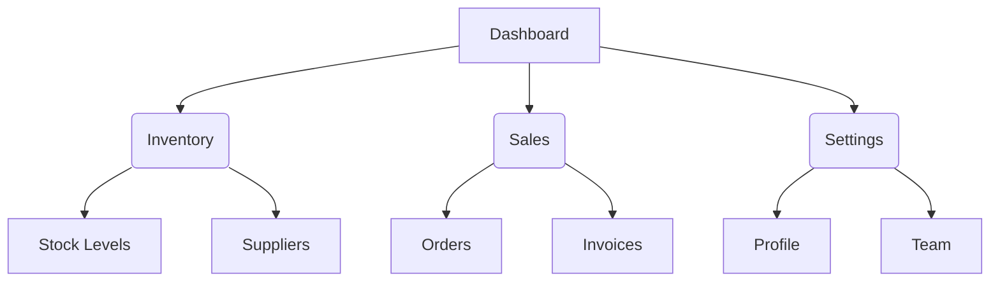

# Information Architecture

Information architecture is the **skeleton of understanding**. If users can't find it, it doesn't exist.

## Pipeline Integration
- **Upstream:** IA pulls from `product-discovery` (who are the users and what do they need to find) and `business-model-reading` (what modules/features exist).
- **Downstream:** The IA sitemap is consumed by `route-integrity-checker` (to validate link intents), `dashboard-scaffolding-contract` (to define nav groups), and `module-registry-sync` (navGroup field in manifests).

### 1. Catalog and Group
Extract all actionable nouns and verbs. Group them logically by user mental models, not internal system architecture.

### 2. Define the Hierarchy
Create a clear, shallow structure.

### 3. Label with Precision
Use concise, familiar, and unambiguous labels. Actionable items use verbs, categorical items use nouns.

## Navigation Anti-patterns
- More than 7 top-level items.
- 4+ levels deep. Keep it flat.
- Mixing verbs and nouns in the same nav level.
- Nav labels that require domain knowledge to decode.

## Completion Criteria
- [ ] No category contains more than 7 sub-items.
- [ ] Hierarchy does not exceed 3 levels deep.
- [ ] Every label is unambiguous and user-centric.
- [ ] Downstream contracts align perfectly with this structure.

## Output Format
A clear, hierarchical Markdown tree or Mermaid diagram representing the sitemap, annotated with user roles if access control applies.
