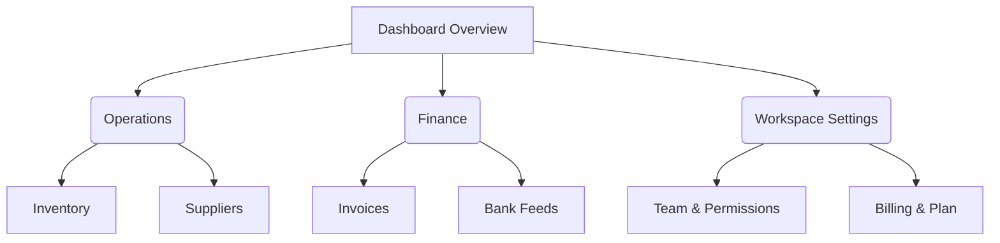

# Information Architecture

**Information architecture is the skeleton of understanding — if users cannot locate a capability within 3 interactions or mental jumps, it does not exist.**

## Pipeline Integration
- **Upstream:** Pulls from `product-discovery` (user mental models) and `business-model-reading` (feature domains).
- **Downstream:** Consumed by `route-integrity-checker` (validating link destinations), `dashboard-scaffolding-contract` (nav groups), `dashboard-layout-patterns` (shell selection), and `module-registry-sync` (navGroup annotations).

### 1. Inventory & domain entity clustering
Extract all key domain nouns (e.g. Invoices, Clients, Transactions) and user verbs (Create, Reconcile, Export). Cluster them into distinct functional hubs based on the user's mental model, not database schema tables.

### 2. Establish hierarchy & grouping rules
Organize the product into a shallow, predictable tree (Maximum 7 top-level categories, Maximum 3 levels deep):

### 3. Precision labeling
- Use consistent grammar: Category hubs use plural nouns ("Customers", "Invoices"); discrete actions use active verbs ("New Order", "Export").
- Avoid internal company acronyms or generic labels ("Other", "Tools", "Data Hub").

### 4. Apply Role-Based Access Control (RBAC) navigation overlay
For products with multi-role permissions (Admin, Manager, Member, Guest):
- Annotate each navigation item with minimum required permissions.
- **Rule of thumb**: Hide navigation items entirely if a user has zero access; do not tease them with dead-end "403 Forbidden" screens.
- Provide a clear annotation matrix:
| Nav Item | Route | Required Role / Scope | Behavior for Unauthorized Roles |
|---|---|---|---|
| Invoices | `/finance/invoices` | `read:finance` | Hidden if unauthorized |
| Billing Settings | `/settings/billing` | `admin:workspace` | Hidden for non-admins |

### 5. Architect discovery alternatives (Search & ⌘K Command Palette)
When a system scales beyond 15–20 views:
- Design a global Command Palette (`⌘K` / `Ctrl+K`) supporting instant fuzzy search across navigation routes, recent entities, and common quick actions.
- Define search indexing scopes (Navigation items vs. Data entities vs. Help documentation).

## Navigation Anti-patterns
- More than 7 items in any navigation group (causes cognitive overload).
- Nesting navigation 4+ levels deep (users get lost).
- Mixing nouns and verbs haphazardly in the same menu tier.
- Displaying disabled/locked navigation links with no explanatory context.

## Completion Criteria
- [ ] Hierarchy structured within 7 top-level groups and ≤ 3 levels deep
- [ ] Labels follow strict grammatical consistency (nouns for hubs, verbs for actions)
- [ ] Multi-role navigation visibility matrix documented with permission scopes
- [ ] Global search / Command Palette indexing rules established for complex apps
- [ ] Sitemap Mermaid diagram matches `dashboard-scaffolding-contract` and `route-intents.json`

## Output Format
A `sitemap.md` artifact containing the hierarchical tree, Mermaid navigation diagram, RBAC role-visibility matrix, and Command Palette shortcut schema.
