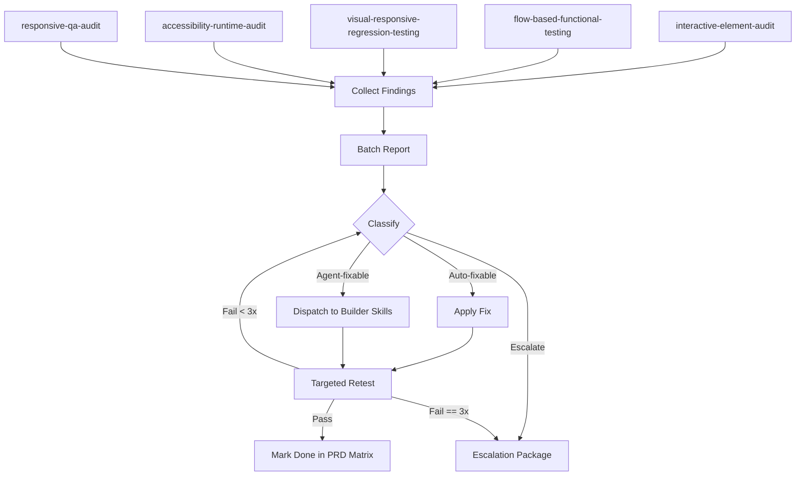

# QA Loop Protocol

**Objective:** Define the exact mechanics of the closed-loop QA cycle. Ensure batching efficiency, strict iteration limits, and clear traceability.

## 1. The Exact Sequence

1. **Collect**: Execute all QA skills (`interactive-element-audit`, `flow-based-functional-testing`, `visual-responsive-regression-testing`, `accessibility-runtime-audit`, `responsive-qa-audit`). Wait for completion. Do not interrupt for piecemeal fixes.
2. **Batch**: Aggregate all findings into a single unified report. No stray single-issue reports.
3. **Classify**: Assign each finding into `Auto-fixable`, `Agent-fixable`, or `Escalate`.
4. **Act**: Apply fixes synchronously (Auto-fix) or dispatch to builder skills (Agent-fix).
5. **Retest**: Run only the specific QA skill that surfaced the original failure.
6. **Escalate**: Push to a human if the loop fails to resolve after 3 iterations.

## 2. Token Efficiency & Batching Rules

- **Do NOT** initiate a separate conversation or round-trip per finding.
- **Do** group findings by component or route to pass to builder skills.
- Exclude verbose stack traces from the main report unless directly necessary. Summarize the exact failure.
- Include element selectors, file paths, and PRD requirement IDs in concise tables.

## 3. The 3-Iteration Maximum Rule

No finding can circle the loop endlessly. A finding has a strict lifecycle:
- Iteration 1: Attempt fix, retest.
- Iteration 2: Re-attempt fix with feedback from previous failure, retest.
- Iteration 3: Final attempt with explicit fallback strategy, retest.
- **Result**: If still failing, immediately halt and generate an Escalation Package.

**Escalation Format:**
```
### ESCALATION: [Finding ID]
- **Issue**: [Brief description]
- **PRD Req**: [Requirement ID]
- **Attempts**: 3
- **Blocker**: [Why the fix failed: e.g., "Dependency missing", "Conflicting styles"]
- **Human Action Required**: [What needs a human decision]
```

## 4. Batch Report Schema

Every finding in the batch must conform to this schema:
- **Finding ID**: Sequential unique ID (e.g., F-012)
- **Source**: Originating QA skill
- **Type**: The class of issue (e.g., A11y Violation, Orphaned Element)
- **Location**: Specific file path, route, and DOM selector
- **PRD Req ID**: Traceability link
- **Severity**: BLOCKER / WARNING / NOTE
- **Classification**: AUTO / AGENT / ESCALATE
- **Recommended Fix**: One-sentence action item

## 5. Classification Rules

- **Auto-fixable**: Deterministic, single-file string/attribute replacements. (e.g., Adding `data-testid`, updating a static `aria-label`, correcting a typo in a route).
- **Agent-fixable**: Logic changes requiring builder skills to synthesize context. (e.g., Modifying a state machine, implementing responsive breakpoint logic, fixing a complex flow bug).
- **Escalate**: Anything requiring subjective trade-offs, modifying third-party dependencies, or fundamentally contradicting the PRD.

## 6. Integration Diagram


